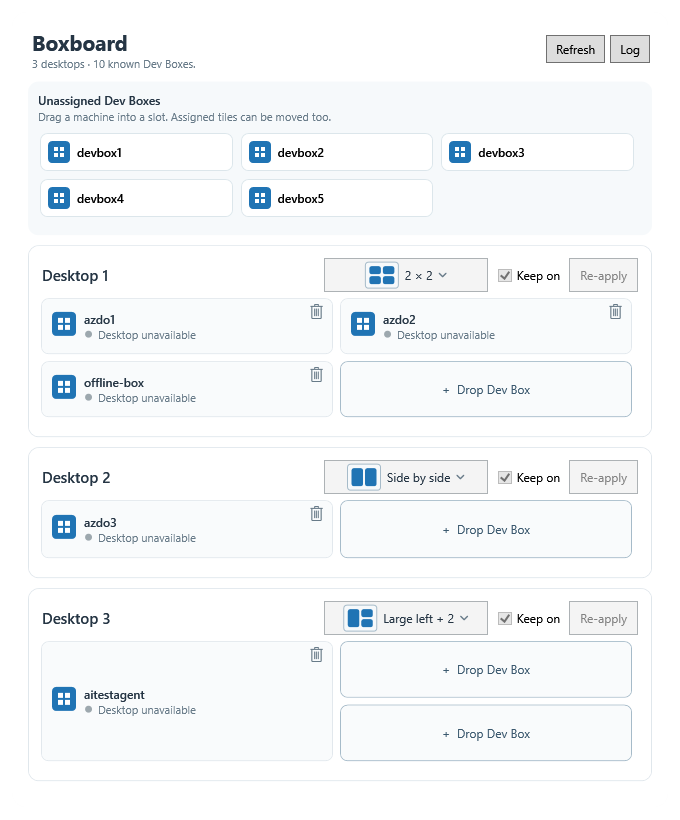

# Boxboard

Boxboard places Microsoft Dev Box windows on Windows virtual desktops. It
remembers which Dev Box belongs in each slot, starts missing clients through
Windows App, and positions their **separate, normal windows**. You can resize
or move a client afterward without Boxboard moving it back.



*Offline demo with synthetic Dev Boxes. No remote desktop content is shown.*

## Install

1. Use Windows 11 build 22621 or later and install
   [Windows App](https://learn.microsoft.com/en-us/windows-app/overview).
   Managing clients across multiple virtual desktops requires Windows 11
   build 26100 or later.
2. Download `Boxboard.exe`, `LICENSE.txt` and `THIRD_PARTY_LICENSE.txt`
   from the [latest release](https://github.com/nohwnd/boxboard/releases/latest).
   Keep the three files together in a folder of your choice. The executable
   is self-contained: no .NET SDK, administrator access or installer is needed.
3. Run `Boxboard.exe`. Click **Refresh** to find your Dev Boxes; Microsoft
   sign-in may be required. Boxboard saves assignments in
   `%LOCALAPPDATA%\Boxboard\settings.json`. The first launch has no
   assignments and does not start a remote client.

For example, to keep the downloaded files under your user profile, open
PowerShell in the folder containing the three release files and run:

```powershell
$install = Join-Path $env:LOCALAPPDATA 'Programs\Boxboard'
New-Item -ItemType Directory -Path $install -Force | Out-Null
Copy-Item .\Boxboard.exe, .\LICENSE.txt, .\THIRD_PARTY_LICENSE.txt -Destination $install
& (Join-Path $install 'Boxboard.exe')
```

Boxboard does **not** start automatically when you sign in. To opt in, make
a shortcut in your Startup folder:

```powershell
$install = Join-Path $env:LOCALAPPDATA 'Programs\Boxboard'
$startup = [Environment]::GetFolderPath('Startup')
$shortcut = (New-Object -ComObject WScript.Shell).CreateShortcut(
    (Join-Path $startup 'Boxboard.lnk'))
$shortcut.TargetPath = Join-Path $install 'Boxboard.exe'
$shortcut.WorkingDirectory = $install
$shortcut.Save()
```

To update, close Boxboard, replace the three files in the install folder,
and run the new executable. Your assignments remain in the separate settings
file. Closing Boxboard does not close Windows App clients. To uninstall,
close Boxboard and remove its install folder and optional Startup shortcut.
Delete `%LOCALAPPDATA%\Boxboard` only if you also want to lose the saved
assignments.

## Use

- Every virtual desktop has a card. Drag an unassigned Dev Box from the top
  tray to a slot, or drag an assigned tile to another slot or desktop.
  Moving an assignment asks for confirmation.
- Choose **2 × 2**, **Side by side**, **Large left + 2**, or **One window**
  on a desktop card. One window fills the monitor's usable work area like
  a maximized window; Windows App keeps its normal frame and taskbar entry.
  Choosing fewer slots unassigns only the slots that disappear. Their Dev
  Boxes return to the top tray; their already-open client windows stay open.
  Switching back to a larger layout does not reassign them automatically.
- Assignment changes and layout choices take effect automatically.
  **Re-apply** explicitly snaps all visible assigned windows back to their
  slots, including windows you have manually resized, and retries missing
  clients. Otherwise, Boxboard leaves manual window positions alone.
- **Keep on** is enabled by default for each desktop. While Boxboard runs,
  it can request a missing assigned client again, with a limit of three
  automatic requests per slot. Turn it off on a card if you want to leave
  a closed client closed. If an assigned Windows App client has one additional
  visible window in its process, Keep on closes the old client and that
  window before requesting a replacement. Turn Keep on off to leave
  reconnect dialogs for manual handling. Windows App handles authentication
  and MFA.
- The tile's **...** menu provides **Connect / Reconnect**, **Bind an
  existing window**, and **Clear assignment**. The **Log** button opens a
  separate in-memory diagnostic window.

**Window open** means that a Windows App window exists, not that its RDP
connection is active. Boxboard does not click Reconnect in Windows App,
bypass Windows lock or sign-in, or store credentials.
If a virtual desktop disappears, its assignments remain saved, but Boxboard
cannot arrange clients on that missing desktop.

## Development

Building from source requires the [.NET 10 SDK](https://dotnet.microsoft.com/download/dotnet/10.0)
on Windows:

```powershell
dotnet build .\Bevdox.slnx -c Release
dotnet test .\Boxboard.Tests\Boxboard.Tests.csproj -c Release
dotnet run --project .\Boxboard -- --demo
```

`--demo` uses an isolated synthetic layout and never controls real clients.
To use a separate real settings file, pass
`--settings C:\path\to\settings.json`. The native WPF integration test shows
real test windows; do not run it over active work without a suitable window.

## License

Boxboard's original code is MIT-licensed under [LICENSE](LICENSE). It builds
on the MIT-licensed [Bevdox](https://github.com/anydot/bevdox) by
[@anydot](https://github.com/anydot). The original Bevdox copyright and the
license for adapted virtual-desktop interop are retained in
[Boxboard/THIRD_PARTY_LICENSE.txt](Boxboard/THIRD_PARTY_LICENSE.txt). Both
license files are included with the release executable.

🤖
